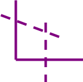

# About the Optimization Tool

__Insert summary of the optimization tool__

_Note: This tool uses the R tool. Install R and the necessary packages by going to Options > Download Predictive Tools._

### Inputs

There are 4 inputs and all are optional

1. __O Input (optional)__ Use this to provide the objective function
2. __A Input (optional)__ Use this to provide the coefficients of the constraint matrix.
3. __B Input (optional)__ Use this to provide the name, direction and right hand side of the constraints.
4. __Q Input (optional)__ Use this to provide the quadratic portion of the objective function, in the case of a Quadratic Programming problem.

### Configuration Properties

1. __Select input mode__ This option controls the mode of input. Currently supports matrix, manual and file inputs.
2. __Select problem type__ We support multiple problem types. Currently supported models include LP, MIP and QP.
3. __Select solver__ The solvers supported currently are Glpk, Gurobi.
4. __Maximize Objective?__ Is this a maximization problem?
5. __Select file__ This is the path to the file.
6. __Select file type__ We currently support CLPEX_LP, MathProg and MPS formats.
7. __Show sensitivity report__ This option controls whether or not to carry out sensitivity analysis and display the results.
8. __Enter Decision Variables__ A comma separated list of decision variable names
9. __Enter objective function__ This is the objective function to be maximized or minimized

### Output

1. __I Output__ This output provides a dashboard of the solution.
